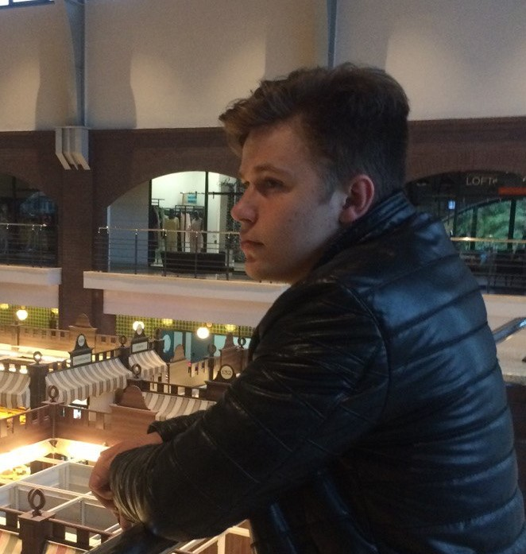

# Vladislav Bryl

## __CONTACTS__
* Phone: +38 (095) 0000000
* Telegram: @adwasarik
* Gmail: adwasarik@gmail.com
* Github: @adwasar

## __SUMMARY__
Passionate trainee frontend developer with a desire to learn and grow in a collaborative team environment. I have basic knowledge HTML, CSS, and JavaScript. Have been self-studying for 5 months  item * 2);
    }

## __LANGUAGES__
 * __English__ - Pre-Intermediate (A2) 
 * __Ukrainian__ - Native 
 * __Russian__ - Native 

## __WORK EXPERIENCE__

__2019 - 2022 / SALES MANAGER I 4GSTAR__

The company was an online store of network equipment. My task was to select and sell equipment for the client's task. 

__2017 - 2018 / SALES MANAGER I FLP SEMYKIN EV__

The company was a call center. My task was to sell wired Internet connection services.

## __EDUCATION__

__2015 - 2019 / Kharkiv State Academy of Culture__ 

Оbtained qualification: 
Bachelor Degree 
Program Subjects Area Management 
Professional qualification 
Bachelor of Management, Manager - Administrator